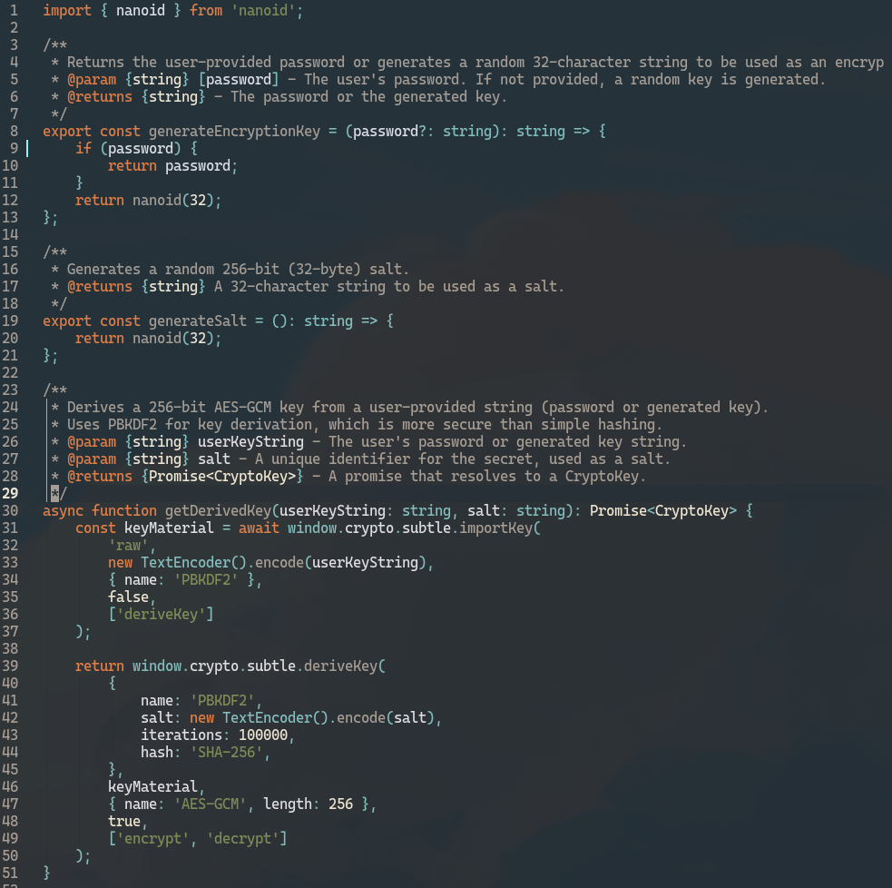

# Serenity

A simple, elegant, and dark theme for Neovim.

<p align="center">
  
</p>

> A quiet mind, a steady hand,  
> Across the code, a peaceful land.  
> No raging seas, no fiery gleam,  
> Just the calm flow of a gentle stream.  

## Installation

Install with your favorite plugin manager.

### lazy.nvim

Add the following to your `lazy.nvim` configuration:

```lua
{
  "bjarneo/serenity.nvim",
  priority = 1000,
  config = function()
    vim.cmd([[colorscheme serenity]])
  end,
}
```

## Usage

To use the theme, add the following to your `init.lua`:

```lua
vim.cmd.colorscheme "serenity"
```
